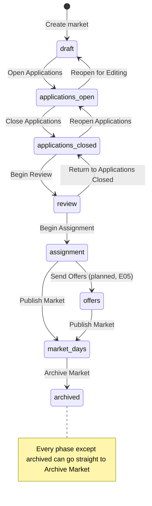

# MVP user flows: from creating a market to market day

As of 2026-10-03, on `fix/mvp-e2e-testing`, after epic E26 ("The user flows hold") fixed every bug the usage run found.
Written from a read of the code, the backlog and the open Wayfinder maps, and a live walk of the app on a local stack.
Statuses were then updated by a usage test run of every flow with five real Google Form exports; its results are in [MVP_TEST_RUN_2026-09-30.md](MVP_TEST_RUN_2026-09-30.md).
After E26 the three intake paths were walked again live with the same exports; [MVP_TEST_RUN_2026-10-03.md](MVP_TEST_RUN_2026-10-03.md) records that re-walk, and the statuses below are as of it.

This is every organizer and vendor flow the product implements or intends, in plain English, from signing up to the end of a market.
It is organized two ways:

- **[Paths](#paths)** follow one way of running a market from start to finish, and name the flows it passes through.
- **[Flows](#flows)** are the individual steps, grouped by lifecycle stage, one numbered flow per variant.

**Intended flows are written as designed, even when something stops them working today.**
A flow that a bug blocks describes what should happen, then says what happens instead and links to [MVP_BUGS.md](MVP_BUGS.md).
Flows that are planned but not built, or built with no screen, are written the same way and gathered again in [Not reachable yet](#not-reachable-yet).

Use it two ways:

- **E2E testing:** each numbered step is a candidate assertion, and "Covered by" names the Playwright specs that already walk it.
  [Coverage map](#coverage-map) lists the gaps.
- **User testing:** paths and flows open with a **Task** you can hand a participant without telling them where to click.

On-screen labels are quoted exactly as the product shows them.

## Status labels

Every flow carries one status, and says whether it was walked live or read from code.
"Walked live" means on the 2026-09-30 usage run, unless the re-walk of 2026-10-03 is named.
A bug the status once named is linked where its fix changed what a step says.

| Status | Meaning |
| --- | --- |
| **Works** | Does what it should. |
| **Works, with bug N** | Completes, but part of the result is wrong. |
| **Blocked by bug N** | Intended and built, but a bug stops it; the flow describes the intended behaviour and then what happens. |
| **Beta** | Reachable and labelled experimental. |
| **No screen** | Built in the back end, reachable only through the API or a URL nobody links to. |
| **Stubbed** | Deliberately switched off until something else exists. |
| **Planned** | Intended, not built; the backlog item is named. |

## Contents

- [People and roles](#people-and-roles)
- [Environment, accounts and external dependencies](#environment-accounts-and-external-dependencies)
- [The market lifecycle at a glance](#the-market-lifecycle-at-a-glance)
- [Paths](#paths)
- [Flows](#flows)
  - [A. Accounts](#a-accounts)
  - [B. Organizations](#b-organizations)
  - [C. Finding and opening markets](#c-finding-and-opening-markets)
  - [D. Creating a market](#d-creating-a-market)
  - [E. Planning the market](#e-planning-the-market)
  - [F. Building the application form](#f-building-the-application-form)
  - [G. Starting from a Google Form's responses](#g-starting-from-a-google-forms-responses)
  - [H. Taking applications](#h-taking-applications)
  - [I. Reviewing applications](#i-reviewing-applications)
  - [J. Assigning tables](#j-assigning-tables)
  - [K. Publishing and market days](#k-publishing-and-market-days)
  - [L. Ending and managing a market](#l-ending-and-managing-a-market)
  - [M. Offers and outcomes (planned)](#m-offers-and-outcomes-planned)
- [Not reachable yet](#not-reachable-yet)
- [Coverage map](#coverage-map)
- [Bugs found while exploring](#bugs-found-while-exploring)
- [Test data recipes](#test-data-recipes)

## People and roles

| Person | Signs in how | What they do |
| --- | --- | --- |
| Organizer | Email and password, or an emailed sign-in code | Runs markets: flows A to L. |
| Organization member | Same as organizer | Sees every market of their organization as a Viewer. |
| Vendor applying online | A 6-digit code emailed per market (no account) | Applies to a market set to "Vendors apply on this market's page", and sees their application (H3). |
| Vendor on market day | Nothing: types the email they applied with | Looks up their table and checks in (K2). |

Organization roles are Owner, Admin and Member.
Being in an organization in any role gives Viewer access to its markets.
A market can also give a person an explicit role, which takes precedence: Owner (4) > Admin (3) > Editor (2) > Viewer (1).

What each market role can do, as the back end enforces it (`back-end/app.py`, `back-end/api/markets.py`, `back-end/api/placements.py`):

| Action | Minimum market role |
| --- | --- |
| See the market, its applications, result, tables, statistics, CSV export, attendance, placement history | Viewer |
| Edit the plan, the application form, review highlights, rename a draft | Editor |
| Run the assignment, place, swap or free a seat | Editor |
| Move the market between phases (the rail), review applications, publish results, import a CSV, start from a CSV, fix the form from the import | Admin |
| Add, remove or change people's market roles | Owner (Admin may manage Editor and Viewer) |
| Delete the market | Owner |

The creator of a market is its Owner.

## Environment, accounts and external dependencies

### Local stack

1. Bring the stack up with `DISABLE_EMAIL=true scripts/th-compose.sh up -d` from a treehouse worktree, or `DISABLE_EMAIL=true docker compose up -d` from the primary checkout.
2. Run `./scripts/seed_fixture.sh`.
   It creates two verified organizers, `e2e@example.com` / `e2epassword123` (owns `Seed Test Org`) and `e2e-noorg@example.com` / `e2enoorg123` (in no organization), plus one draft market.
3. Open the front end printed by the script (5173 on the primary stack, `5173 + slot*10` in a worktree) and sign in.

On a freshly built front-end container, the first visit to each lazily loaded page can render blank for a few seconds while Vite optimizes dependencies and reloads.
This is a dev-server effect, not a product bug; wait and retry before filing it.

### Accounts

- An account made through the Register tab cannot sign in locally: registration sends a verification email, and with `DISABLE_EMAIL=true` nothing is sent.
  Make local organizers with `back-end/create_test_user.py` (which sets `email_verified`), or `ensureVerifiedUser()` in a spec.
- Sign-in codes (organizer "Sign-in code" tab, vendor applicant sign-in) and password-reset links are also email-only.
  Locally they need either a real Resend key or a database seed (see [Test data recipes](#test-data-recipes)).

### External services

| Dependency | Needed by | Local default | What breaks without it |
| --- | --- | --- | --- |
| MongoDB | Everything | Docker `mongodb` service | Nothing works. The back end also refuses to boot until `migrations/migrate_market_keys.py` has run on an old volume. |
| Resend (`RESEND_API_KEY`, `FROM_EMAIL`, `FRONTEND_URL`) | A1, A3, A4, H3 | `DISABLE_EMAIL=true`: nothing is sent | No verification, reset or code ever arrives. |
| Google reCAPTCHA v3 (`RECAPTCHA_SECRET_KEY` + `VITE_RECAPTCHA_SITE_KEY`) | A1 | `DISABLE_CAPTCHA=true` plus a blank site key | Deployed signup fails if the two keys are not a pair. |
| TypeSafe (`TYPESAFE_API_KEY`) | G, sorting a CSV's columns | Unset; rules alone decide | Nothing: optional. Only headings, answer counts and shapes are sent, never values. |
| Google Sheets / Google Forms | G and H2: the organizer's CSV export | Fixtures below | Nothing in the product; it is where real organizers get their file. |
| Floorplan image or PDF | E6 | `front-end/e2e/fixtures/test-floorplan.png` | Only the beta floorplan path. The wizard makes no AI calls and needs no keys. |

### Fixtures

| File | What it is | Used in |
| --- | --- | --- |
| `back-end/tests/test_data/google_forms/fall-2023.csv`, `spring-2024.csv`, `spring-2025.csv`, `fall-2025.csv`, `spring-2026.csv` | Five anonymised real Google Form exports (237 rows in `fall-2025.csv`, 30 columns, per-day tier grid, checkbox certifications) | G, H2 |
| `back-end/tests/test_data/google_forms_export.csv` | A smaller Google Form export | H2 |
| `.scratch/examples/markets/*.csv` in the primary checkout | Five real exports (2023 to 2026), untracked, with real applicants' details; never commit or quote them | G, H2, user testing |
| `front-end/e2e/fixtures/test-floorplan.png` | 800x600 floor plan image | E6 |

## The market lifecycle at a glance

A market is always in exactly one phase.
The phase rail under the market's name shows the lifecycle, and offers one forward button with every other move behind "More…".
Every rule about moving between phases lives in `back-end/guards.py`; the front end shows any refusal as a red "Cannot proceed:" panel under the rail.

| Phase (rail label) | What happens here | Page a market opens on | Forward button | More… |
| --- | --- | --- | --- | --- |
| Draft | Plan, build the form, set intake | Market Setup | Open Applications | Archive Market |
| Applications Open | Import CSVs or receive online applications; review as they arrive | Applications | Close Applications | Reopen for Editing, Archive Market |
| Applications Closed | Import stragglers, review | Applications | Begin Review | Reopen Applications, Archive Market |
| Review | Finish reviewing | Applications | Begin Assignment | Return to Applications Closed, Archive Market |
| Assignment | Set rules, run, adjust by hand | Assignment, then Result once run | Publish Market | Send Offers, Archive Market |
| Offers (planned) | Vendors accept or refuse | Result | Publish Market | Archive Market |
| Market Days | Vendors check in | Attendance | none | Archive Market |
| Archived | Read only | Result if it was assigned, else Market Setup | none | none |

Guards, each shown as a "Cannot proceed:" message when it fails:

| Move | Refused when | Message says |
| --- | --- | --- |
| into Applications Open (from Draft or Applications Closed) | The form asks nothing: no custom field, and the plan has no dates, no tiers and fewer than 2 sections | "The application form asks nothing…" |
| Applications Open → Draft | At least one application exists | "N applications have already been submitted…" |
| Review → Assignment | Any application still Open or Under review; or no applications at all | "N applications are still awaiting review…" / "There are no applications…" |
| Review → Assignment | An approved applicant named a tier that has no tables | Names the tier and the applicants |
| Review → Assignment | A hand placement names a seat the plan no longer has | Names the vendor, table and date |
| Assignment → Offers | Any application is still Approved (always true today: see M1) | "N applications are still approved but not yet assigned or unassigned…" |
| Assignment or Offers → Market Days | No assignment has been computed | "No assignment has been computed for this market…" |

Moves that cannot be undone (Publish Market, Archive Market) open a confirmation dialog focused on Cancel.
Every other move fires on one click.

## Paths

A path is one way of running a market from start to finish.
Paths share most of their flows; the tables below say which flows each one runs through and where it parts from the others.
They are written as intended; where a bug breaks one, the step says so.

### P1. CSV intake, form built by hand

**Task:** "You collect applications with your own spreadsheet. Set up this year's market, bring in the applications, choose who gets in, give them tables, and run check-in on the day."

**Status:** Works (re-walked live on 2026-10-03 with the 2023 export, through assignment).
The plan's sections have no tier and the file has no "how many days" column, the two conditions that stopped it on the usage run ([bugs 23](MVP_BUGS.md#bug-23) and [24](MVP_BUGS.md#bug-24)).
277 of the file's 294 rows import: ten repeat submissions fold into each applicant's latest row, and seven blank rows are skipped as blank. All 277 approved vendors are placed.
Every column but Timestamp and Email Address is mapped by hand (H2a).
`market-journey.spec.ts` walks it as far as assignment.

| Step | Flows |
| --- | --- |
| Account and organization | A2, B1 |
| Create the market from scratch | D1 |
| Plan it by hand (or from a floorplan, E6) | E1 to E5, "I collect applications elsewhere" |
| Build the form | F1, F2, F3 |
| Open applications | H1 |
| Import the spreadsheet, fixing mapping and values as needed | H2a to H2j |
| Close applications and review | H4, I1, I2, I4, I5 |
| Assign and adjust | J1 to J13 |
| Publish and run market day | K1 to K5 |
| End the market | L1 |

### P2. CSV intake, started from last year's Google Form

**Task:** "You ran this market last year with a Google Form. Use last year's responses to set this year's market up, then bring in this year's responses and run it."

This is the MVP's headline path (Wayfinder `real-market-readiness`: "an organizer can take a real Google Forms export from a real market through to a correct, published assignment").

**Status:** Works (re-walked live on 2026-10-03 with the March 2026 export, from creation to archive).
The proposal restores all 29 columns, and the first import previews 225 of 250 rows where the usage run imported none ([bugs 2](MVP_BUGS.md#bug-2), [3](MVP_BUGS.md#bug-3) and [4](MVP_BUGS.md#bug-4)).
The 25 it skips are a blank row, malformed and test rows, and applicants whose only answers were options left out on the proposal; G4 warned of those before confirming, and "Keep all" would have kept them.
The other four exports were not re-walked live; their anonymised copies are held to a hand-written answer key in `back-end/tests/test_csv_proposal.py`.

| Step | Flows |
| --- | --- |
| Create the market from the Google Form | D2, then G3 to G5 (or G2 from an existing draft) |
| Finish the plan the file cannot describe: locations, sections, table counts | E3, E4 |
| Adjust the generated form | F2, F3 |
| Open applications | H1 |
| Import this year's export: the mapping is restored, so it should need no decisions | H2a (restored), H2h for later exports |
| Everything after | as P1 from "Close applications and review" |

Intended at the import: every row that answers the required questions imports, "Full table" and "Half table" match the table choices, and ticked certification boxes read as ticked.

### P3. Online intake: vendors apply on the market's page

**Task (organizer):** "Vendors should apply on your market's own page this year. Set that up and share the link."
**Task (vendor):** "Apply to Harbour Night Market for both dates, then check whether you got in."

**Status:** Works (re-walked live on 2026-10-03).
A vendor who had never applied signed in with an emailed code, applied, stayed signed in across a reload, and read "Approved" once applications had closed and results were published ([bugs 6](MVP_BUGS.md#bug-6), [20](MVP_BUGS.md#bug-20), [21](MVP_BUGS.md#bug-21) and [36](MVP_BUGS.md#bug-36)).
A vendor brought in by CSV import can sign in and edit too (P4).

| Step | Flows |
| --- | --- |
| Create and plan, choosing "Vendors apply on this market's page" | D1, E1 to E5 |
| Build the form | F1 to F3 |
| Open applications and share the Application page link from the rail | H1 |
| Vendors sign in with an emailed code, apply, and can edit while applications are open | H3a to H3d |
| Close applications and review | H4, I1 to I5 |
| Publish results so vendors see their verdict | I7, H3c |
| Assign, publish, run market day, end | J, K, L as in P1 |

### P4. Mixed intake: online form plus imported stragglers

**Status:** Works (walked live): import is gated by phase only, so a form market can import too.
A tier grid in the imported file maps whatever its day headings say, matched to the market's dates (H2c).
An imported vendor then has an application, so they can sign in to the market's page and edit it (H3b).
Whether mixed intake is intended is not written down anywhere; confirm before testing it as a feature.

| Step | Flows |
| --- | --- |
| As P3 through opening applications | D1, E, F, H1 |
| Import applications collected elsewhere | H2a |
| Vendors sign in and edit | H3b, H3c |
| Everything after | as P3 |

### P5. Offers: vendors accept or refuse their tables

**Status:** Planned (backlog `E05`, status proposed).
"MVP ends at 'assignment computed'; the organizer communicates results themselves."
The Send Offers button already exists and is always refused ([M1](#m1-the-solver-records-who-was-assigned)).

| Step | Flows |
| --- | --- |
| As P3 through assignment | P3 |
| The solver records each approved application as assigned or unassigned | M1 |
| Send offers | M2 |
| Vendors are told and accept or refuse | M3, M4 |
| Publish, market day, end | K, L |

### P6. Ending early, or not at all

| Situation | Flows |
| --- | --- |
| Abandon a market before it runs | L2 |
| Remove a market entirely | L5 |
| Wind up an organization and every market in it | B5a to B5c |
| Return a market to draft to fix its form before anyone applies | F5 |

## Flows

### A. Accounts

#### A1. Register and verify an organizer account

**Status:** Works; a signed-out person sees the confirmation at step 4 since [bug 22](MVP_BUGS.md#bug-22) was fixed (`auth.spec.ts`).
Steps 1 to 3 walked live as far as reCAPTCHA allows (the slot-1 stack has real keys and refuses automated browsers).
**Task:** "Create an account for yourself."

1. Go to `/login` and choose the Register tab.
2. Enter email, password (at least 8 characters) and the same password again; choose "Create account".
3. Expect a success message saying a verification link was emailed and that sign-in is impossible until it is followed.
4. Open the emailed link, which lands on `/verify-email`; expect confirmation.
5. Sign in (A2).

Branches: mismatched passwords, short password, an email already registered, an expired or reused link.
Depends on: reCAPTCHA (bypassed locally), Resend.
Covered by: `auth.spec.ts` ("Register new user").

#### A1a. Resend the verification email

**Status:** Works (code; `POST /resend-verification`).
From the verification page, ask for another link.

#### A2. Sign in and sign out

**Status:** Works (walked live).
**Task:** "Sign in, then sign out."

1. At `/login`, Sign in tab, enter email and password, choose "Sign in".
2. Expect the dashboard (`/dashboard`).
3. Choose "Sign out" on the dashboard or in the navigation menu (C4); expect `/login`.

Branches: wrong password, unverified account, "Show" password toggle, visiting an organizer URL while signed out (redirects to `/login`), visiting `/login` while signed in (redirects to the dashboard).
A market link opened while signed out lands on the dashboard after sign-in, not on the market.
Covered by: `auth.spec.ts`, `smoke.spec.ts`.

#### A3. Sign in with an emailed code

**Status:** Works as far as it can be walked without a mailer (walked live).

1. At `/login`, choose the "Sign-in code" tab, enter email, choose "Send code".
2. Enter the code from the email and choose "Sign in".
3. "Use a different email" returns to step 1.

Covered by: none found.

#### A4. Reset a forgotten password

**Status:** Works; a signed-out person reaches the form at step 2 since [bug 22](MVP_BUGS.md#bug-22) was fixed (`auth.spec.ts`).

1. At `/login`, choose "Forgot password?"; enter email on `/reset-password-request`.
2. Follow the emailed link to `/reset-password`, set a new password.
3. Sign in with the new password.

Covered by: `auth.spec.ts` ("Password reset").

#### A5. Delete my account

**Status:** No screen (`POST /delete-user` exists; nothing in the front end calls it).

### B. Organizations

A market must belong to an organization, and its organization never changes after creation.

#### B1. Create an organization

**Status:** Works (walked live).
**Task:** "Set up an organization for your market team."

1. Dashboard, "Organizations" (or `/organizations`).
2. "New organization", name it, confirm.
3. Expect a card with the name and your role (Owner).

A person with no organization gets one made for them from the create-market dialog (D4).
Covered by: `tier2.spec.ts` ("Organization CRUD").

#### B2. Add an admin or a member

**Status:** Works (walked live); a Viewer's market pages draw no control they cannot use ([bug 37](MVP_BUGS.md#bug-37)).

1. On an organization card, "Manage".
2. Under Admins, "Add admin", enter an existing account's email, "Add"; under Members, "Add member" likewise.
3. Expect the person listed and the dialog still open (closing is not saving).
4. Sign in as that person: every market of the organization is visible to them as a Viewer.

Branches: an email with no account, someone already in the organization, an Admin trying Owner-only actions.
Covered by: `tier2.spec.ts`, `dialog-idiom.spec.ts`, `access-control.spec.ts`.

#### B3. Remove a person

**Status:** Works (walked live).
"Remove" beside them, with no confirmation; they lose Viewer access to the organization's markets unless the market gives them a role of its own.
Covered by: `access-control.spec.ts` ("org membership changes").

#### B4. Rename an organization

**Status:** Works (walked live).
Manage, "Rename organization", edit, "Save".
Covered by: `tier2.spec.ts`.

#### B5. Delete an organization

Manage, "Delete organization" opens a preview of what would be destroyed; confirm to delete.
A deletion record is written before anything is destroyed (`back-end/deletion_trail.py`).
Covered by: `org-deletion.spec.ts`.

- **B5a. It holds no markets.**
  **Status:** Works (walked live).
  "This organization holds no markets, so nothing else goes with it."
- **B5b. It holds only drafts and archived markets.**
  **Status:** Works (walked live with a draft; the archived case read from code).
  Each market is listed with what is destroyed, including, for an archived market that ran, the check-in page it keeps up as a record (L1, [bug 9](MVP_BUGS.md#bug-9)).
- **B5c. It holds a market mid-lifecycle** (Applications Open through Market Days).
  **Status:** Works (walked live).
  Refused, naming each blocking market: "Archive or delete them first, then come back."

#### B6. Transfer ownership

**Status:** No screen (`POST /organizations/<id>/transfer` exists; no screen offers it).

### C. Finding and opening markets

#### C1. The dashboard

**Status:** Works (walked live).
**Task:** "Get back to the market you were working on."

After sign-in the dashboard shows one of:

- "Previously opened": a card for the last market this browser opened.
- "N markets are open to you." with "Open a market".
- "You have not set up a market yet…" with "Set up your first market", which opens the Markets list.
  It adds that every market belongs to an organization, which someone in none creates under Organizations first (D4).
- "The market you last opened is no longer available…" when it was deleted or access was lost.

"Markets" and "Organizations" lead to those lists.
Covered by: `dashboard-market-count.spec.ts`.

#### C2. The markets list

**Status:** Works (walked live).
`/markets` lists every reachable market with its phase badge, dates ("Nov 17-21, 2025 (5 days)"; two separate days are named both, "Oct 3 and 10, 2026") and organization; a long name is cut with an ellipsis rather than wrapped ([bug 14](MVP_BUGS.md#bug-14)).
Clicking a card opens the market; "Manage" opens the Manage market dialog (L3 to L5).
Covered by: `dashboard-market-count.spec.ts`, `access-control.spec.ts`.

#### C3. Open a market by its address

**Status:** Works (walked live).

1. `/markets/<id>` lands on the page for the market's phase (see the lifecycle table).
2. Every page has its own address: `/markets/<id>/setup`, `/form`, `/applications`, `/assignment`, `/result`, `/vendors`, `/attendance`, plus the `/import`, `/start-from-csv` and `/floorplan` flows.
3. Old addresses redirect: `/markets/<id>/tables` to `/result`, `/market-setup` and other id-less paths to `/markets`, `/floorplan-editor?marketId=<id>` to the floorplan flow.
4. An id you cannot reach shows "This market does not exist, or you do not have access to it." with "Choose a market".

Covered by: `every-market-page-has-an-address.spec.ts`, `one-market-from-the-server.spec.ts`, `the-frame-stays-put.spec.ts`.

#### C4. The navigation menu

**Status:** Works (walked live).
The menu button top left opens Markets, Organizations, "Market vendors" (only while a market is open; goes to its Vendors page) and Sign out.

#### C5. The old start screen

**Status:** No screen (reachable at `/init` by URL only).
Two buttons, "Set Up New Market" (opens the create-market dialog) and "Load Existing Market" (a market picker).
Nothing links to it; it predates the Markets list.

### D. Creating a market

#### D1. Create a market from scratch

**Status:** Works (walked live).
**Task:** "Start a new market called Winter Market 2026."

1. `/markets`, "New market".
2. The dialog asks for **Organization**, **Market name** and **How do you want to start?** ("Start from scratch", the default, or "I already have a Google Form").
3. Enter a name and choose "Create market" (Enter also submits).
4. Expect `/markets/<id>/setup` in Draft, with the market bar (Market Setup, Application Form, Applications, Assignment) and the phase rail.

An empty name keeps "Create market" disabled.
Covered by: `new-market-org.spec.ts`, `dialog-idiom.spec.ts`.

#### D2. Create a market that starts from a Google Form

**Status:** Works (re-walked live on 2026-10-03, as P2).
As D1, choosing "I already have a Google Form"; lands on `/markets/<id>/start-from-csv` (flow G).
Covered by: `where-a-form-starts.spec.ts`.

#### D3. Choose among several organizations

**Status:** Works (walked live).
With more than one organization the Organization field is a dropdown starting on "Select organization", and "Create market" stays disabled until one is chosen; with exactly one it is plain text.
Covered by: `dialog-idiom.spec.ts` ("with exactly one organization"), `new-market-org.spec.ts`.

#### D4. Create a market with no organization yet

**Status:** Works (walked live).
With none, the dialog says "No organizations available. Create an organization" and keeps "Create market" disabled.
The link goes to `/organizations` (the dialog and anything typed in it are lost); after creating an organization there, start again from "New market".
The dashboard says the same: create the organization under Organizations first ([bug 42](MVP_BUGS.md#bug-42)).
Covered by: `new-market-org.spec.ts` (the zero-organization user).

#### D5. A name that is already someone's address

**Status:** Works (walked live): "Another market already uses the web address /pier-draft-market. Choose a name that is different in more than accents or punctuation."
The name becomes the public URL slug, so a name whose slug is taken is refused, look-alikes included ("Cafe Market" beside "Café Market").
Covered by: `public-address.spec.ts`.

### E. Planning the market

Market Setup is one scrolling page of cards that saves itself.
"Plan saved" appears after each edit (debounced about 0.6 s); a failed save says "Could not save the plan. Retry in a moment."
One edit is one save, and another tab's edits survive it ([bug 25](MVP_BUGS.md#bug-25), `plan-saves-once.spec.ts`).
Any pending edit is saved before a phase move, so guards judge what the organizer sees.

**Task for the section:** "Your market runs on two Saturdays in October in Pier Hall, with 4 premium tables in the North Row and 6 standard tables in the South Row. Set that up."

#### E1. Market dates

**Status:** Works (walked live).

1. In "Market Dates", step months with the arrows and click days to toggle them.
2. Expect chosen days listed by month beside the calendar ("Sat 3 ×") with a count ("2 market days").
3. Remove a day with its "×" or by clicking it again.

Dates are calendar days and must show as the same day in every time zone.
The calendar opens on the current month and has no month or year jump, and it accepts dates in the past without comment.
Each day is a toggle button named by its full date ("Monday, November 20, 2023").
Covered by: `market-dates-by-month.spec.ts`, `date-display-timezone.spec.ts`.

#### E2. Tiers

**Status:** Works (walked live).
"+" adds a row; drag to set priority (1 is best); "×" removes; a tier no section uses shows "No tables".

#### E3. Locations

**Status:** Works (walked live).
"+" adds a row; type a name.

#### E4. Sections

**Status:** Works (walked live).
"+" adds a row of name, Location, Tier and Count; "Total tables" sums the counts; tables are named after their section ("North Row 1" to "North Row 4").
A section may have no tier; a plan without tiers assigns, and its form asks no tier preference ([bug 23](MVP_BUGS.md#bug-23); re-walked live as P1).
Covered by: `plan-cards-share-a-row.spec.ts`, `sizing-model.spec.ts`, `market-pipeline.spec.ts`.

#### E5. How vendors apply

**Status:** Works (walked live).

1. Choose "I collect applications elsewhere" (the default; vendors come in by import) or "Vendors apply on this market's page" (the form goes live at `/<market-slug>/apply` while applications are open).
2. It saves at once, and is greyed out once the market leaves Draft: "This is fixed once a market leaves draft…".

A CSV market's applicant pages answer exactly as a nonexistent market's.
Covered by: `intake-mode.spec.ts`.

#### E6. Sections from a floorplan

**Status:** Beta (steps 1 to 4 walked live; grouping by lasso not driven); "Auto-Place Tables" places the count asked for of each type ([bug 38](MVP_BUGS.md#bug-38)).
Offered as "Set up sections from a floorplan instead" while the plan has no sections.

1. "Choose your setup path": "Manual setup" (Recommended) or "Floorplan AI" (BETA), "Try the beta".
2. `/markets/<id>/floorplan`, a five-step wizard with "← Back" and "Next →":
   1. **Upload:** drop or "Browse Files" (PNG, JPG, WebP, PDF; a PDF asks which page).
   2. **Calibrate:** drag a reference line starting on the image, "Enter Reference Length" with a unit, "Calibrate", "Done" (or "Redraw").
   3. **Place Tables:** define "Table Types" (name, width, height, unit, max capacity), optionally "Save as Template" / "Load Template", then "Auto-Place Tables", which asks how many of each type to place and says how many fitted.
   4. **Edit Layout:** draw walls and no-go zones with the "Wall Editor" toggle, move tables, "Group Sections" by lasso and "Assign Section" (name, location, optional tier), "Export PNG" with or without table codes and sections; "Next" stays disabled until sections are grouped.
   5. **Save:** "Review & Save Floorplan" lists totals, sections and locations with editable names; "Save & Continue" writes the sections to the plan.

Despite the name the wizard makes no AI calls; placement is a geometry solver.
Only one table type is used by assignment in this release (F6).
Covered by: `floorplan.spec.ts` (grouping and editing are driven through store state, not real gestures).

#### E7. Edit the plan after Draft

**Status:** Works (walked live).
The plan stays editable in every phase but Archived, where every page is read only ([bug 30](MVP_BUGS.md#bug-30)), and except where a rule says otherwise:

- the intake mode freezes when the market leaves Draft (E5);
- the essential questions' offering freezes at the first applicant answer, so later plan edits no longer change the form (F1);
- the assignment rules lock once the market can no longer return to Assignment (J14);
- shrinking the plan never unassigns anyone until the assignment is run again (J5); a pinned seat that disappears becomes an orphaned pin (J10).

#### E8. Application form readiness

**Status:** Works (re-walked live on 2026-10-03).
The "Application form" card says what the plan still lacks ("Add dates, tiers, two or more sections above…"), offers "Build the application form" once it can, and once the form has questions or is locked says so, with "Open the application form" or "See the application form" ([bug 16](MVP_BUGS.md#bug-16)).

### F. Building the application form

Page: Application Form; the Form Builder on the left, a live applicant Preview on the right.

**Task:** "Add a required question asking what category of product each vendor sells: Food, Crafts or Art."

#### F1. The essential questions

**Status:** Works (re-walked live on 2026-10-03).

1. The "Essential questions" panel ("Always included") lists the questions every form asks, derived from the plan and not removable: Email (from sign-in), Full name (the official one), Preferred name (optional; what they like to be called), Available dates, Number of dates you want, Tier preference (per date, with "Not available"), Table choice ("A whole table to myself", "Half a table, shared", "Either is fine"), Table-share partner (optional), Section preference (a ranking, with an "Ask this" checkbox; needs 2 or more sections) ([bug 17](MVP_BUGS.md#bug-17)).
2. The preview asks them as an applicant will.
3. A question with nothing to offer is hidden from applicants and says why ("No market dates yet…").
4. Untick "Ask this" under Section preference to stop asking it; every applicant is then treated equally on sections.
   It saves at once, stays off through later form edits, and the applicant form then asks no ranking ([bugs 29](MVP_BUGS.md#bug-29) and [45](MVP_BUGS.md#bug-45)).

Covered by: `essential-fields.spec.ts`, `section-preference.spec.ts`.

#### F2. Custom questions

**Status:** Works (walked live).

1. "Add Field"; set Label (the Key is derived), Type (Text, Number, Select, Multi-Select, Checkbox, Date, Email), Required, Options for Select and Multi-Select ("Add option"), Help Text.
2. Drag to reorder; "Remove" deletes.
3. "Save Form"; expect "Saved".

"Save Form" is disabled and says why while a field is invalid ('Field "Product category" is a select and needs at least one option.'); keys may not start with `essential_` and must be unique.
Covered by: `application-form.spec.ts`.

#### F3. What a reviewer reads first

**Status:** Works (walked live).
Tick the questions that should lead each review card; it saves itself and stays editable in every phase.
Covered by: `review-highlights.spec.ts`.

#### F4. The form lock

**Status:** Works (walked live).
Once the market leaves Draft, or once any application exists, the builder is replaced by "Application form can only be edited while the market is in draft phase. Current phase: …".
Covered by: `phase-state-machine.spec.ts`.

#### F5. Reopen the market to fix the form

**Status:** Works (walked live).
From Applications Open, More…, "Reopen for Editing" returns the market to Draft so the form can be edited, then "Open Applications" again.
Refused once any application exists ("N applications have already been submitted…").
The import offers the same fix without leaving the page (H2e, H2f).
Covered by: `phase-state-machine.spec.ts`.

#### F6. Table type preference

**Status:** Stubbed.
The question exists but is hidden while every table is one type: "Every table is the same type for now… This question appears once a floorplan gives your market more than one table type."
Assignment uses one type in this release, so even a floorplan with several types does not turn it on in practice.

### G. Starting from a Google Form's responses

Nothing is written until the organizer confirms, and the file is not stored.
The confirm also saves the import's column mapping, so the first import of the same file opens "Restored from your last import."
Covered by: `start-from-csv.spec.ts`, `where-a-form-starts.spec.ts`.

#### G1. From the create-market dialog

**Status:** Works (walked live).
See D2.

#### G2. From an existing draft

**Status:** Works (walked live).
Market Setup, How vendors apply, "Start from my Google Form's responses".
Disabled, with the reason, once the form has questions of its own: "This market's form already has questions of its own, so it can't be started from a Google Form's responses."

#### G3. Upload and the year question

**Status:** Works (walked live).

1. Drop or choose the CSV (Google Sheets: File, Download, Comma-separated values).
2. If the form's dates have no year, "Which year are these dates in?" checks weekdays against the year ("Monday, November 17 is a Monday in 2025."); "Use this year".
3. The year can be changed later with "change" beside the file summary.

#### G4. Review and adjust the proposal

**Status:** Works (re-walked live on 2026-10-03 with the March 2026 export).
Labels stay whole ([bug 41](MVP_BUGS.md#bug-41)), an option with commas in it stays one option ([bug 27](MVP_BUGS.md#bug-27)), and "Number of dates you want" may be left unasked, since the import does not require it of a file ([bug 24](MVP_BUGS.md#bug-24)).

1. "What the file says about your plan": market dates, tiers best first, and "Most days one vendor may get" (an assignment rule, choosable).
2. "Every column, in your file's order": each column's first answers and what it "Becomes": an essential question, "Your question" with a type, Required and kept options, or "Left out".
3. Rows with a yellow edge are worth a second look; rare options are unticked by default ("chosen by 2 - keep?").
   Rare means fewer than 3 applicants, or, for a multi-select, under a set share of its answers, so an option chosen by 4 can be unticked too.
   A required question whose unticked options would leave applicants with no answer says how many; "Show all answers" lists every one and "Keep all" ticks them ([bug 4](MVP_BUGS.md#bug-4)).
4. The side panel counts "to check", "answer essential questions", "become your questions" and "left out".

#### G5. Confirm

**Status:** Works (re-walked live on 2026-10-03, as P2).
"Create the form and plan" lands on Application Form with the questions in file order and the plan's dates and tiers filled; add locations and sections by hand (E3, E4).

#### G6. Cancel

**Status:** Works (walked live).
"Cancel" at any step writes nothing and returns to Market Setup.

### H. Taking applications

#### H1. Open applications

**Status:** Works (walked live).

1. Rail: "Open Applications".
2. Expect Applications Open, the Applications tab carrying the dot, the form locked (F4).
3. For a form market, the rail shows "Application page" with the public URL and "Copy" on one line, shortening the address rather than wrapping ([bug 11](MVP_BUGS.md#bug-11)).

Covered by: `phase-state-machine.spec.ts`, `phase-rail.spec.ts`.

#### H1a. Refused: the form asks nothing

**Status:** Works (walked live).
With no custom field and a plan offering nothing, "Cannot proceed: The application form asks nothing…".
Covered by: `phase-state-machine.spec.ts`.

#### H2. Import applications from a CSV

Page: Applications, "Import from CSV", allowed in Applications Open and Applications Closed for either intake mode; elsewhere the button is disabled with the reason.
`/markets/<id>/import`, four steps: Upload, Map columns, Preview, Confirm.
Covered by: `csv-import.spec.ts`, `form-amendment.spec.ts`, `market-journey.spec.ts`.

**Task:** "Bring in the applications you collected in your spreadsheet."

##### H2a. First import, everything maps

**Status:** Works (re-walked live on 2026-10-03 for P1 and P2).
On a first import only Timestamp and Email Address are mapped for you, even where a heading matches a question word for word (a usability observation, not a bug).

1. **Upload:** "Choose the CSV your form produced"; the page names the market ("Importing into …").
2. **Map columns:** every column in file order with sample answers, mapped to a question or "Ignore this column"; "Required questions" ticks each one off; "All required questions are mapped."
3. **Preview** ("Preview import"): "N of M rows will be imported", "Each imported row becomes an application awaiting your review.", the first rows as they will be stored, "Where each answer comes from".
4. **Confirm** ("Import N rows"): "Imported N new applications"; "Back to applications" returns to Applications ([bug 16](MVP_BUGS.md#bug-16)).
5. Expect N applications, each Open and awaiting review.

For a market started from a Google Form, step 2 opens "Restored from your last import." and needs no decisions.

##### H2b. Answers that match no option

**Status:** Works (re-walked live on 2026-10-03).
Answers are split only where the comma is not inside an option, so "Monday, November 20th" arrives whole and reads as that market date ([bug 27](MVP_BUGS.md#bug-27)).
"N values did not match …" lists each unmatched answer with "Choose…" to match it to an option, or "Ignore this value"; "Re-check values" re-runs the check.
Values already decided, including those a Google Form start saved, are listed under "N values already decided - change any that are wrong" and can be changed ([bug 28](MVP_BUGS.md#bug-28)).
"N values still need a match." blocks the preview until each is settled.

##### H2c. A question spread over several columns

**Status:** Works (`csv-import.spec.ts`): a tier grid's day headings, in whatever words, are matched to the market's dates, and its cells to tiers ([bug 26](MVP_BUGS.md#bug-26)).
Grid questions (one column per option or per day, such as a tier grid) are grouped as one row showing their columns; "Not one question - split" treats them separately.
A column whose options contain commas while its answers are comma-separated says "One column cannot answer … reliably".

##### H2d. A required question has no column

**Status:** Works (walked live).
"Number of dates you want" is not required of a file: a vendor with no answer is limited by their availability and the market's ceiling ([bug 24](MVP_BUGS.md#bug-24)).
The preview stays disabled until every required question is mapped; "Required questions" shows which are missing ("Still unmapped: …").
A custom question can be made optional by reopening for editing (F5, before any application exists); an essential constraint cannot be switched off, so the only fix is a new column in the spreadsheet.

##### H2e. Add a question for a column with nowhere to go

**Status:** Works (code), only while no application exists yet.

1. A column that matches nothing shows "This column has nowhere to go…" and "Add a question for it".
2. The dialog lists "Questions this market asks" and offers "Add a question" (Question, Answer key).
3. It warns: "While this runs, this market's public application page is briefly unavailable." and that the form's publication date will be re-dated.
4. Confirm: the market steps back to Draft, the form is written, and the market returns to the phase it started in; "Your upload and your mapping stay exactly as they are."

Refused when it would leave the form asking nothing, or when a guard on the way back would fail; each blocker is named before anything moves.
Covered by: `form-amendment.spec.ts`.

##### H2f. Stop asking a preference the form never asked

**Status:** Works (walked live), only while no application exists yet.
On an online-form market whose form does ask the preference it says the file has no column for it, not that the form never asked ([bug 40](MVP_BUGS.md#bug-40)).
"Your form never asked <question>. It is a preference, not a constraint…" with "Stop asking it", which runs the same chain as H2e to switch that essential question off.

##### H2g. Finish a fix that stalled

**Status:** Works (code).
If the H2e/H2f chain stops part way, the dialog says where it stopped and offers "Put the market back".

##### H2h. Import a later export

**Status:** Works (walked live; re-walked on 2026-10-03, where ten repeat submissions folded into their latest rows).
An applicant listed more than once is one application, from their latest row, dated by their first; an unchanged applicant keeps their approval, and "N updated" counts only changed answers ([bugs 34](MVP_BUGS.md#bug-34) and [40](MVP_BUGS.md#bug-40)).

1. The mapping is restored by column heading; "N columns are new since then." and lost columns are named to map again.
2. The preview also says how many approved applications "will return to review" because their answers changed, and how many existing applications are not in the file ("They will be left exactly as they are.").
3. Confirm: "Imported N new applications, updated M".

A first-come-first-served priority rule with no column mapped to "Submitted at" warns that it "will order nothing".

##### H2i. Rows that cannot be imported

**Status:** Works (re-walked live on 2026-10-03).
The preview lists "N rows will be skipped" with every reason for each row, and confirming writes only the good rows ([bug 5](MVP_BUGS.md#bug-5)).
A blank row says "Every column this import reads is empty."; an answer the organizer chose to ignore on a required question says so, rather than that the applicant left it blank, and the fix is on the previous step.

##### H2j. Import after applications close

**Status:** Works (walked live).
In Applications Closed the page says "You can still import the ones you collected elsewhere."
From Review, import is refused until the market returns to Applications Closed.
From Assignment onwards it is refused for good, and says so: "…it takes no more applications and nothing more can be imported." ([bug 42](MVP_BUGS.md#bug-42)).

#### H3. Vendors apply online

Only for a market set to "Vendors apply on this market's page", only while Applications Open.
Covered by: `applicant.spec.ts` (sign-in, seeding the application first), `intake-mode.spec.ts`.

##### H3a. A new vendor applies

**Status:** Works (re-walked live on 2026-10-03 on a phone-sized window; [bug 6](MVP_BUGS.md#bug-6)).
**Task (vendor):** "Apply to this market."

1. The vendor opens the shared link `/<market-slug>/apply`; "Sign in" names the market.
2. They enter their email, "Send code"; the page says "We've sent a code to <email>." whatever the address.
3. The code arrives; they enter it under "Sign-in code" and choose "Sign in".
4. "Apply for <market>": the essential questions, then "More questions" (the custom ones); "Save application".
5. They land on "Your application" (H3c) with status Submitted.

##### H3b. A returning vendor edits their application

**Status:** Works (re-walked live on 2026-10-03), while applications are open.
Sign in as H3a steps 1 to 3 with an address that already has an application (applied before, or imported); "Your application" offers "Change your answers".
The form opens with their saved answers; they change what they need and "Save application", and land on "Your application" ([bug 21](MVP_BUGS.md#bug-21)).
A reload or a direct link in the same tab keeps them signed in; a new tab asks them to sign in again ([bug 36](MVP_BUGS.md#bug-36)).
The first applicant save of any kind freezes the essential questions' offering (F1).

##### H3c. A vendor checks their application

**Status:** Works (re-walked live on 2026-10-03, before and after applications closed; [bug 20](MVP_BUGS.md#bug-20)).
"Your application" shows "Signed in as", the status, "Submitted <date>", "Your Answers", "Change your answers" while applications are open, and "Sign out".
Statuses a vendor sees: Submitted, Under Review, and after Publish Results (I7) Approved or Not Accepted.
A vendor can sign in and read their application and verdict in every phase after Draft; applying and changing answers stop when applications close.

##### H3d. Codes that fail

**Status:** Works (code).
One attempt per code: a wrong code uses it up; "Code already sent - retry in Ns" and "Resend code in 60s" pace requests; every failure reads "Invalid or expired code." so nothing reveals whether an address applied.
Covered by: `applicant.spec.ts`.

##### H3e. A CSV market's public pages

**Status:** Works (walked live).
`/<slug>/apply`, the sign-in and the dashboard of a CSV market answer exactly as for a market that does not exist.
Covered by: `intake-mode.spec.ts`.

#### H4. Close applications

**Status:** Works (walked live).
"Close Applications": online applications stop; CSV import stays available.
Covered by: `phase-state-machine.spec.ts`.

#### H5. Reopen applications

**Status:** Works (walked live).
From Applications Closed, More…, "Reopen Applications" (the form guard runs again).
Covered by: `phase-state-machine.spec.ts`.

### I. Reviewing applications

Page: Applications.
Reviewing has no phase gate of its own, so it can start as soon as applications arrive; it must be finished before Begin Assignment.

**Task:** "Go through the applications and decide who gets in."

#### I1. Work through the queue

**Status:** Works (walked live).

1. "1 of N to review", a tally ("N reviewed · A approved · R rejected") and one card at a time.
2. A card shows the applicant's email, status, submitted date, the highlighted answers first, then "N more answers" (or "This application carries no answers."); a web address in an answer is a link that opens in a new tab.
3. "Reject" (R), "Skip" (S), "Approve" (A); the keyboard letters work.
4. When the queue is empty: "All N reviewed", "Nothing left to review."

An advisory appears when the form asks only the essential questions, since every card then reads alike.
Covered by: `market-journey.spec.ts` (the only spec that clicks Approve).

#### I2. Change a decision

**Status:** Works (walked live); the list shows only emails, with no search or filter.
"Show N reviewed" lists decided applications with "Approve instead" / "Reject instead".

#### I3. Choose what leads the card

**Status:** Works (walked live).
"Choose what leads the card" on a card edits the highlights (F3) in place.
Covered by: `review-highlights.spec.ts`.

#### I4. Begin review

**Status:** Works (walked live).
From Applications Closed, "Begin Review".

#### I5. Begin assignment

**Status:** Works (walked live).
From Review, "Begin Assignment", refused (each with its message) while any application is unreviewed, when there are none, when an approved applicant named a tier with no tables, or when a pin is orphaned.
Covered by: `phase-state-machine.spec.ts`, `placement-pins.spec.ts`.

#### I6. Return to Applications Closed

**Status:** Works (walked live).
From Review, More…, "Return to Applications Closed", for example to import stragglers.

#### I7. Publish results

**Status:** Works (re-walked live on 2026-10-03), in one click with no confirmation; the vendor read "Approved" after applications closed (H3c).
Form markets only (hidden for CSV markets, and the back end refuses it there and on drafts).

1. "Publish Results" (after at least one review); becomes "Results Published".
2. Each online applicant sees Approved or Not Accepted on "Your application" (H3c).

### J. Assigning tables

The Assignment tab holds three pages: Assignment (rules and run), Result (by table) and Vendors (by vendor).

**Task:** "Give each approved vendor their tables, putting current students first, and no vendor more than 3 days."

#### J1. Priority rules

**Status:** Works (walked live).
"Add a rule", choose a question (form questions with a fixed set of answers, "When the application arrived", "Application type"), then add answers best first; unlisted answers sort last, or where "<All others>" is placed.
Rules apply in order; "×" (a button named "Remove rule N") removes one.
Covered by: `market-pipeline.spec.ts`, `the-assignment-tabs-pages.spec.ts`.

#### J2. Assignment options

**Status:** Works (walked live).
"Max assignments per vendor" (at most the number of market dates; blank for no ceiling) and "Max half table proportion per section (%)" (0 to 100); Assign stays disabled, and says why, until the proportion is set.

##### J2a. No ceiling on dates

**Status:** Works (re-walked live on 2026-10-03; [bug 7](MVP_BUGS.md#bug-7)).
Leave "Max assignments per vendor" blank ("No ceiling") and run with no limit.

#### J3. Run the assignment

**Status:** Works (re-walked live on 2026-10-03, with and without tiers; [bug 23](MVP_BUGS.md#bug-23)).
"Assign" lands on Result.
Dates fill in calendar order, so later days can end up nearly empty; that is known behaviour, kept as it is ([bug 39](MVP_BUGS.md#bug-39)).
Covered by: `market-pipeline.spec.ts`, `the-result-page.spec.ts`.

##### J3a. Refused: an approved application is incomplete

**Status:** Works (walked live).
The whole run is refused, naming the applicants missing a required answer.

##### J3b. Refused outside the Assignment phase

**Status:** Works (code).
The button is disabled with the reason; the server refuses too.

#### J4. Read the result

**Status:** Works (walked live).

1. Summary: "N of M vendors placed", "N of M tables used", "N unassigned" (links to Vendors filtered), "N% satisfaction" (the share of requested, possible dates vendors got).
2. "Statistics" (placements by group) and "Download CSV".
3. Filters by Date, Section, Tier and Table size, shown as removable chips with "Clear all"; counts of assigned, partial and empty tables.
4. Tables by date then section; each seat shows its occupant's name and email, or "Vacant" / "Unassigned".

Covered by: `the-result-page.spec.ts`, `tables.spec.ts`, `tier2.spec.ts` (CSV export).

#### J5. The result is out of date

**Status:** Works (walked live).
When the rules, the plan or the approved applications change after a run, a banner says so with "Run it again".
Changing the plan does not unassign anyone until the run is repeated.
Covered by: `the-result-knows-what-it-was-made-from.spec.ts`.

#### J6. Place a vendor in an empty seat

**Status:** Works (walked live); check-in sends the vendor to the seat placed ([bug 1](MVP_BUGS.md#bug-1), K2).
Click "Place someone": choose the vendor ("Every vendor who applied already has a table on this date." when none is left) and, for a half table, the seat; "Place them here".
Warnings name what the placement overrides (not available that date, asked for a whole table, a tier they refused, their date limit); a seat already taken is refused, naming its holder ([bug 32](MVP_BUGS.md#bug-32)).
Covered by: `placement-edit.spec.ts`.

#### J7. Swap two vendors

**Status:** Works (walked live).
Click an occupied seat ("Change"), "Swap them with" any vendor seated that date, "Swap seats"; both seats change at once.
The same warnings as J6 apply to both vendors, including a change of table size ([bugs 18](MVP_BUGS.md#bug-18) and [32](MVP_BUGS.md#bug-32)).
Covered by: `placement-edit.spec.ts`.

#### J8. Free a seat

**Status:** Works (walked live).
"Free this seat" ("Freeing this seat leaves them with no table on this date until they are placed again.").
Covered by: `placement-edit.spec.ts`.

#### J9. Run again, keeping hand placements

**Status:** Works (walked live).
Every hand placement is a pin; "Run again" says "Keeps your N hand placements; places everyone else again." and seats pins first.
Covered by: `placement-pins.spec.ts`.

#### J10. A pin the plan no longer holds

**Status:** Works (`placement-pins.spec.ts`; [bug 31](MVP_BUGS.md#bug-31)).
Removing a pinned seat from the plan orphans the pin (never deletes it); it blocks the next Begin Assignment until moved or freed.
In Assignment the result pages mark it, and Publish Market is refused until it is re-placed or freed.
Covered by: `placement-pins.spec.ts`.

#### J11. Browse by vendor

**Status:** Works (re-walked live on 2026-10-03).
Vendors: "Search vendors" and "N of M vendors assigned", counting approved vendors only ([bug 10](MVP_BUGS.md#bug-10)); each row shows Assigned or Unassigned and "N / M dates".
Result's "N unassigned" link opens this list filtered, with an "Unassigned only ×" chip to clear the filter.
A vendor's panel shows their Submission, their Assignments per date with "Change placement", or "Not available on this date".
Covered by: `vendors.spec.ts`.

#### J12. Find out why a vendor was not placed

**Status:** Works (walked live); a vendor at their date limit, or at the market's ceiling, is told so ([bug 33](MVP_BUGS.md#bug-33)).
An unplaced date on a vendor's panel states the reason the solver could not place them, with a link to place them by hand.

#### J13. Placement history

**Status:** Works (walked live).
A vendor's panel lists each change to their placements: "Swapped Idikit and Utal - now at Front 10 and Back 1", who made it and when; a solver run is one entry.

#### J14. The rules close with the assignment

**Status:** Works (walked live).
Once the market can no longer return to Assignment, the priority and options are locked and the page says why.
Covered by: `the-assignment-rules-close.spec.ts`.

### K. Publishing and market days

#### K1. Publish the market

**Status:** Works (re-walked live on 2026-10-03).
**Task:** "Your assignment is final. Make it live so vendors can find their tables."

1. Rail: "Publish Market".
2. "Publishing puts this market's check-in page on the air…" and "A published market cannot be returned to an earlier phase."; focus starts on Cancel.
3. Expect Market Days, an "Attendance" tab, and "Check-in page" with its URL and "Copy" in the rail.

Refused without a computed assignment: "No assignment has been computed for this market…".
Covered by: `phase-rail.spec.ts`, `phase-state-machine.spec.ts`.

#### K2. A vendor looks up their table and checks in

**Status:** Works (re-walked live on 2026-10-03 on a phone-sized window).
**Task (vendor):** "You are at the market. Find your table and check in."

1. `/<market-slug>/check-in` names the market before anything is typed.
2. Enter the email applied with, "Look up".
3. Expect a greeting by name, then one card per assigned date: table, table size, section, tier, location; today's first.
4. "Check in"; expect "Checked in ✓ <time>" and "Undo".

The cards show the stored assignment, so a vendor placed, swapped or freed by hand is sent where they were put ([bug 1](MVP_BUGS.md#bug-1)).
Covered by: `checkin.spec.ts`.

#### K3. Check in on a day that is not today

**Status:** Works (walked live).
"Today is not one of your days at this market. You can still check in for a day below."

#### K4. Undo a check-in

**Status:** Works (walked live).
"Undo" on a checked-in card removes it.
Covered by: `checkin.spec.ts` ("a check-in on the wrong day can be undone").

#### K5. Watch attendance

**Status:** Works (re-walked live on 2026-10-03).
Attendance: vendors (by email) against dates with the check-in time in each cell, or "No check-ins recorded yet."; only vendors who checked in appear, by design, so it does not show who is missing (a usability observation).
Covered by: `checkin.spec.ts`.

#### K6. Send offers instead of publishing

**Status:** Planned (E05); the button exists and is always refused.
See [M2](#m2-send-offers).

### L. Ending and managing a market

#### L1. Archive after market days

**Status:** Works (re-walked live on 2026-10-03).

1. More…, "Archive Market"; "Archiving is permanent…" and "Its check-in page stays up as a record…", focus on Cancel; "Archive".
2. Expect the rail frozen with "This market is archived. It was published and ran its market days." ([bug 8](MVP_BUGS.md#bug-8)); every page read only ([bug 30](MVP_BUGS.md#bug-30)).
3. The check-in page stays up as a record: "This market has ended. You can still look up where you were placed, and when you checked in.", each date "Checked in" or "Not checked in", and no check-in ([bug 9](MVP_BUGS.md#bug-9)).
Covered by: `phase-state-machine.spec.ts`.

#### L2. Abandon a market early

**Status:** Works (walked live).
Archive from any earlier phase; it is read only, and no check-in page is served; the note reads "It was abandoned before it ran.", "It took applications but was never assigned." or "It was assigned but never published…".

#### L3. Manage who has access

**Status:** Works (walked live).
Markets list, "Manage": "Users with access" lists explicit roles with a role dropdown (Owner, Admin, Editor, Viewer); "Add user" (email and role, "Add"); "Remove"; the organization line says "Its members can view it."
The Owner's own dropdown is offered, and changing it is refused with "Cannot change owner's role".
Covered by: `tier2.spec.ts` ("Market role management"), `access-control.spec.ts`.

#### L4. Rename a market

**Status:** Works (walked live in Draft).
Editable in Draft only; afterwards "This market's public web address comes from its name, and it has already been shared, so its name can no longer change."
Covered by: `public-address.spec.ts`.

#### L5. Delete a market

**Status:** Works (walked live).
Owner only: "Delete market" opens "Delete <market>?", which names what goes ("This deletes the market with its applications, its assignment, its check-in records…") and opens on Cancel ([bug 43](MVP_BUGS.md#bug-43)).
Everything the market kept beside itself is deleted with it ([bug 47](MVP_BUGS.md#bug-47)).
Covered by: `tier2.spec.ts`.

### M. Offers and outcomes (planned)

Backlog `E05` ("Offers and the applicant-facing flow", status proposed): "An applicant applies through the market's public page, learns the outcome, receives an offer, and accepts or refuses it - and the organizer sees all of that."
None of this is built beyond the pieces named.

#### M1. The solver records who was assigned

**Status:** Planned.
After a run, each approved application becomes Assigned or Unassigned.
Today nothing writes those statuses, so "Send Offers" is always refused while anyone is approved (the Assignment to Offers edge is deadlocked).

#### M2. Send offers

**Status:** Planned; the button exists.
More…, "Send Offers" in Assignment would move applications to Assignment Sent and the market to Offers.

#### M3. A vendor accepts or refuses

**Status:** Planned.
The vendor answers their offer; the application becomes Accepted or Not Accepted, and the organizer sees it.

#### M4. Outcome emails

**Status:** Planned.
Approval, rejection and offer mail; the mailer sends only account mail today.
Before any is sent, E05 requires a decision on imported addresses, which nobody has verified.

#### M5. The market's public page

**Status:** Stubbed.
`/<market-slug>` shows only the market's name; E05 makes it the market's real public page.

## Not reachable yet

Everything intended or built that an organizer or vendor cannot complete through the product today.
No bug blocks a flow any more: the fourteen rows that once stood here for bugs were cleared by E26.

| Flow | Kind | Why | What reaching it takes |
| --- | --- | --- | --- |
| A5 Delete my account | No screen | API only | A screen |
| B6 Transfer an organization | No screen | API only | A screen |
| C5 Old start screen | No screen | `/init` by URL | Remove it, or link it |
| F6 Table type preference | Stubbed | One table type in MVP | Assignment that uses several table types |
| E6 Floorplan sections | Beta | Experimental | Real-gesture test coverage; several table types in assignment |
| M1 to M4 Offers and outcome mail | Planned | E05 | The epic |
| M5 Public market page | Stubbed | E05 | The epic |

## Coverage map

| Flows | Specs that walk them | Gap worth a spec |
| --- | --- | --- |
| A Accounts | `auth.spec.ts`, `smoke.spec.ts` | A3 organizer sign-in code |
| B Organizations | `tier2.spec.ts`, `dialog-idiom.spec.ts`, `access-control.spec.ts`, `org-deletion.spec.ts` | none noted |
| C Finding markets | `dashboard-market-count.spec.ts`, `every-market-page-has-an-address.spec.ts`, `one-market-from-the-server.spec.ts`, `the-frame-stays-put.spec.ts` | none noted |
| D Creating | `new-market-org.spec.ts`, `dialog-idiom.spec.ts`, `public-address.spec.ts`, `where-a-form-starts.spec.ts` | none noted |
| E Planning | `market-dates-by-month.spec.ts`, `plan-cards-share-a-row.spec.ts`, `intake-mode.spec.ts`, `floorplan.spec.ts` | E6 grouping as a real gesture |
| F Form | `application-form.spec.ts`, `essential-fields.spec.ts`, `section-preference.spec.ts`, `review-highlights.spec.ts`, `phase-state-machine.spec.ts` | none noted |
| G Start from a Google Form | `start-from-csv.spec.ts`, `where-a-form-starts.spec.ts` | none noted (G5 then H2a runs on an anonymised export) |
| H2 Import | `csv-import.spec.ts`, `form-amendment.spec.ts`, `market-journey.spec.ts` | none noted |
| H3 Online applications | `applicant.spec.ts`, `intake-mode.spec.ts`, `essential-fields.spec.ts` | none noted |
| I Reviewing | `market-journey.spec.ts`, `review-highlights.spec.ts`, `phase-state-machine.spec.ts`, `result-and-review-read-cleanly.spec.ts` | I1 keyboard review |
| J Assigning | `market-pipeline.spec.ts`, `the-result-page.spec.ts`, `tables.spec.ts`, `placement-edit.spec.ts`, `placement-pins.spec.ts`, `vendors.spec.ts`, `the-assignment-rules-close.spec.ts` | none noted |
| K Publishing and market days | `phase-rail.spec.ts`, `checkin.spec.ts`, `alignment.spec.ts` | none noted |
| L Ending | `phase-state-machine.spec.ts`, `tier2.spec.ts`, `org-deletion.spec.ts`, `market-records.spec.ts` | none noted |
| Paths | `market-journey.spec.ts` walks P1 as far as assignment | **P1 and P2 whole, from creation to archive** |

## Bugs found while exploring

The walk behind this document found 21 problems, from check-in sending vendors to the wrong table down to stale copy, and the usage test run with real exports found 23 more (bugs 22 to 44).
Fixing them found three more (45 to 47), and the re-walk after the fixes found the last ones (48 onwards).
They are written up, with reproductions, in [MVP_BUGS.md](MVP_BUGS.md); every one is fixed by epic E26 except bug 39, which is kept as known behaviour.
What E26 left as it is, bug 39 and the usability observations, is in [MVP_KNOWN_GAPS.md](MVP_KNOWN_GAPS.md).
The runs' flow-by-flow results are in [MVP_TEST_RUN_2026-09-30.md](MVP_TEST_RUN_2026-09-30.md) and [MVP_TEST_RUN_2026-10-03.md](MVP_TEST_RUN_2026-10-03.md).

## Test data recipes

Seed through the API rather than the UI when a spec is about a later step; helpers live in `front-end/e2e/helpers/`.

| Need | Use |
| --- | --- |
| A verified organizer | `scripts/seed_fixture.sh` users, or `ensureVerifiedUser()` (`verifiedUser.ts`) |
| An organization for a market | `ensureTestOrg()` / `ensureTestOrgAuthenticated()` (`seeds.ts`) |
| A draft market | `seedDraftMarket.ts` |
| A market in a given phase | `seedPhaseMarket.ts` |
| A market with approved vendors | `seedMarketWithVendors()` (`seeds.ts`) |
| An assigned market | `seedAssignedMarket()` (`seedAssignedMarket.ts`) |
| A published market ready for check-in | `seedPublishedMarketWithAssignments()` (`seeds.ts`) |
| An application written straight to Mongo | `seedApplication()` (`seedApplication.ts`) |
| A form-intake market and a vendor sign-in code | `seedApplicantMarket()` and `createApplicantLoginChallenge()` (`seedApplicantMarket.ts`); plant the challenge after the UI requests a code, because a request replaces it |
| A market opened by URL | `marketSetupPath()` / `marketScreenPath()` (`marketScreens.ts`) |

Any fixture whose market serves applicants must set `intakeMode: "form"`; without it the applicant endpoints answer 404.
An assignment can only be stored in the Assignment phase, so walk the market there before seeding one.
